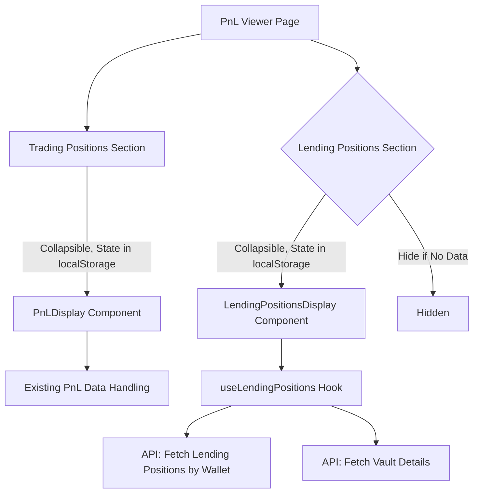

# DeFiTuna Lending Positions Integration Plan

## Overview
This plan outlines the integration of user-specific lending positions alongside the existing PnL positions on the main PnL viewer page of the DeFiTuna application. The goal is to provide users with a unified view of their financial data without navigating away from the primary interface, maintaining consistency in design and functionality.

## Objective
Display user-specific lending positions alongside PnL positions using collapsible sections on the main PnL viewer page (`src/pages/index.js`). The lending positions will be fetched based on the same user-input wallets as trading positions, using a different endpoint for lending data.

## Integration Strategy
1. **Add Collapsible Sections on the PnL Viewer Page**
   - Implement collapsible sections for both "Trading Positions" and "Lending Positions" on the main PnL viewer page.
   - The open/closed state of each section will be saved in localStorage to ensure the state persists across page refreshes, providing a consistent user experience.
   - Both sections will auto-expand by default if data is available, but users can collapse/expand them manually, with the preference saved.
   - Hide the "Lending Positions" section entirely if no lending positions are found for the active wallets, maintaining a clean UI.
   - Modify `src/pages/index.js` to include state for the collapsible sections (e.g., `isTradingExpanded`, `isLendingExpanded`) and use localStorage to save these states. Conditionally render the `PnLDisplay` and new `LendingPositionsDisplay` components based on data availability and user preference.

2. **Create a New Component for Lending Positions**
   - Develop a new component, `LendingPositionsDisplay`, in `src/components/pnl/` to render lending positions in a table format consistent with `PositionsTable`.
   - Ensure the UI layout remains consistent with the existing design, using the same styling and loading indicators as the trading positions (`LoadingOverlay.js` or similar components).
   - This component will display data fetched from the lending positions endpoint, tailored to the user's active wallets.

3. **Fetch Lending Positions Data**
   - Create a new hook, `useLendingPositions`, in `src/hooks/` to manage fetching and state for lending positions data.
   - The hook will dynamically construct the API endpoint based on the user's active wallets (e.g., `https://api.defituna.com/api/v1/users/{walletAddress}/lending-positions`), ensuring consistency with the wallet logic used for trading positions.
   - Use the same debounce and error handling logic as in `useDebounceApi.js` to maintain consistency with trading position fetches.
   - Handle loading and error states using the same loading indicator as trading positions to provide a seamless user experience.
   - Integrate with the existing auto-refresh logic (`useAutoRefresh.js`) to ensure lending positions refresh at the same intervals as trading positions.

4. **Fetch Vault Details for Tooltip**
   - Use the provided Vault API (e.g., `https://api.defituna.com/api/v1/vaults/{vaultAddress}`) to fetch detailed information about each vault associated with a lending position.
   - Cache vault data to minimize redundant API calls and display vault details (e.g., deposited funds, borrowed funds, APY) in a tooltip when hovering over the vault name/icon in the table.
   - Utilize the existing mint endpoint for metadata (e.g., token name and icon) to display in the Vault column alongside the tooltip.

## Display Suggestions for Lending Positions Table
The lending positions table will maintain a consistent look and feel with the trading positions table, with the following columns:
- **Vault**: Display the vault name and mint icon (fetched from the existing mint endpoint), with a tooltip showing detailed vault information from the Vault API (e.g., deposited funds, borrowed funds, supply APY, borrow APY, utilization).
- **Wallet**: Display the authority address (e.g., `5bxoPwxEoYMAwfuLWRQRSmS2M926GjYXEUjrR9xC2dZ3`) with copy-to-clipboard functionality.
- **Funds**: Display the funds amount and USD value (e.g., `1069` and `$0.001069`).
- **Supply APY**: Show the annual percentage yield for the supply in the vault (e.g., `3.34%`), fetched from the Vault API.
- **Earned**: Show the earned amount and USD value (e.g., `16` and `$0.000016`).
- **Actions**: Include action buttons for user interaction (see below).

## Action Buttons for Lending Positions
- **Share**: Allow users to share the current data of a lending position, mirroring the functionality in trading positions. This will copy the current snapshot of the position data for sharing.

## Architectural Considerations
- **Separation of Logic and UI**: Data fetching and business logic for lending positions will be handled in the `useLendingPositions` hook, keeping the UI component (`LendingPositionsDisplay`) focused on rendering.
- **API Separation**: API calls for lending positions and vault details will be isolated in the hook, maintaining separation from other logic.
- **Auto-Refresh Logic**: The lending positions section will follow the same auto-refresh logic as trading positions, using the existing `useAutoRefresh` hook to synchronize refresh intervals.
- **Documentation**: Detailed documentation will be added for the new hook and component to align with project requirements.

## Visual Representation
Below is a flowchart illustrating the integration on the PnL viewer page with collapsible sections:

## Requirements

### Technical Requirements
- Fetch lending positions dynamically using the API endpoint based on active user wallets.
- Implement a new hook `useLendingPositions` for data management, ensuring separation of logic from UI.
- Use Vault API to fetch detailed vault information for tooltips.
- Cache API responses to minimize redundant calls.
- Integrate with existing auto-refresh logic for consistent data updates.

### User Requirements
- Allow users to view both trading and lending positions on the same page without navigation.
- Provide collapsible sections for better organization, with user preference saved in localStorage.
- Enable interaction through Share and Chart buttons for lending positions, similar to trading positions.
- Hide lending positions section if no data is available to maintain a clean interface.

### UI Requirements
- Ensure consistent design with existing trading positions table, using the same styling and loading indicators.
- Display vault name and mint icon with a tooltip for detailed vault data.
- Implement responsive design to ensure usability on all screen sizes.
- Provide visual feedback for user interactions like collapsing/expanding sections.

## Tasks Breakdown
1. **Update PnL Viewer Page Layout**:
   - Add collapsible sections for trading and lending positions in `src/pages/index.js`.
   - Implement state management for collapse/expand with localStorage persistence.
2. **Develop Lending Positions Component**:
   - Create `LendingPositionsDisplay` component in `src/components/pnl/` for rendering lending data.
   - Ensure UI consistency with existing components.
3. **Implement Data Fetching Hook**:
   - Develop `useLendingPositions` hook in `src/hooks/` to fetch lending positions based on active wallets.
   - Integrate Vault API for tooltip data and cache responses.
4. **Integrate Auto-Refresh Logic**:
   - Connect lending positions data fetching to the existing auto-refresh mechanism.
   - Handle loading and error states consistently with trading positions.
5. **Add Action Buttons Functionality**:
   - Implement Share button for lending positions, mirroring trading positions.

## Current Status
- Task 1 (Update PnL Viewer Page Layout) ✅ Completed
- Task 2 (Develop Lending Positions Component) ✅ Completed  
- Task 3 (Implement Data Fetching Hook) ✅ Completed
- Task 4 (Integrate Auto-Refresh Logic) ✅ Completed
- Task 5 (Add Action Button Functionality) ✅ Completed

